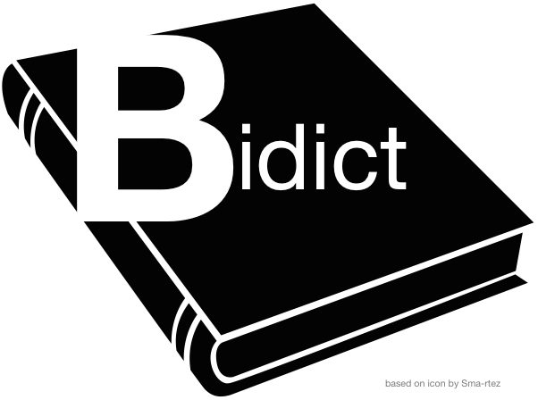

bidict
======

Efficient, Pythonic bidirectional map implementation and related functionality.

Status
------

.. Hide until https://github.com/badges/shields/issues/716 is fixed
.. .. image:: https://img.shields.io/pypi/dm/bidict.svg
..     :target: https://pypi.python.org/pypi/bidict
..     :alt: Downloads per month

.. image:: https://img.shields.io/pypi/v/bidict.svg
    :target: https://pypi.python.org/pypi/bidict
    :alt: Latest release

.. image:: https://img.shields.io/readthedocs/bidict/master.svg
    :target: https://bidict.readthedocs.io/en/master/
    :alt: Documentation

.. image:: https://travis-ci.org/jab/bidict.svg?branch=master
    :target: https://travis-ci.org/jab/bidict
    :alt: Travis-CI build status (Linux and macOS)

.. image:: https://ci.appveyor.com/api/projects/status/gk133415udncwto3/branch/master?svg=true
    :target: https://ci.appveyor.com/project/jab/bidict
    :alt: AppVeyor build status (Windows)

.. image:: https://codecov.io/gh/jab/bidict/branch/master/graph/badge.svg
    :target: https://codecov.io/gh/jab/bidict
    :alt: Test coverage

.. image:: https://api.codacy.com/project/badge/Grade/6628756a73254cd895656348236833b8
    :target: https://www.codacy.com/app/jab/bidict
    :alt: Codacy grade

.. Hide to reduce clutter
.. .. image:: https://img.shields.io/pypi/pyversions/bidict.svg
..     :target: https://pypi.python.org/pypi/bidict
..     :alt: Supported Python versions
..
.. .. image:: https://img.shields.io/pypi/implementation/bidict.svg
..     :target: https://pypi.python.org/pypi/bidict
..     :alt: Supported Python implementations
..
.. .. image:: https://img.shields.io/badge/lgtm-👍-blue.svg
..     :target: https://lgtm.com/projects/g/jab/bidict/
..     :alt: LGTM

.. image:: https://img.shields.io/pypi/l/bidict.svg
    :target: https://raw.githubusercontent.com/jab/bidict/master/LICENSE
    :alt: License

Bidict:
^^^^^^^

- is in use by several teams at Google, Venmo, Bank of America Merrill Lynch,
  and many others,
- has carefully designed APIs for
  safety, simplicity, flexibility, and ergonomics,
- is CPython-, PyPy-, Python 2-, and Python 3-compatible,
- has extensive `test coverage <https://codecov.io/gh/jab/bidict>`_,
  including property-based tests and benchmarks,
  which are run continuously on all supported Python versions and OSes,
- integrates with Python’s collections interfaces and abstract base classes,
- has mature, well-factored, well-documented code.

Community and Support
---------------------

.. image:: https://img.shields.io/badge/chat-on%20gitter-5AB999.svg?logo=gitter-white
    :target: https://gitter.im/jab/bidict
    :alt: Chat

If you are thinking of using bidict in your work,
or if you have any questions, comments, or suggestions,
I'd love to know about your use case
and provide as much support for it as possible.

Please feel free to leave a message in the
`chatroom <https://gitter.im/jab/bidict>`_
or `open an issue <https://github.com/jab/bidict/issues>`_
after reviewing the :doc:`contributors-guide`. [#fn-contributing]_

Notice of Usage
---------------

If you are already using bidict, and especially if
you/your organization is a significant user,
please `let me know <mailto:jab@math.brown.edu>`_ you're using it!

Changelog
---------

See the :doc:`changelog` [#fn-changelog]_
for a history of notable changes to bidict.

.. .. include:: release-notifications.rst.inc
.. duplicate rather than `include` release-notifications so it renders on GitHub:

Release Notifications
---------------------

.. image:: https://img.shields.io/badge/Sibbell-follow-40263B.svg
    :target: https://sibbell.com/github/jab/bidict/releases/
    :alt: Follow on Sibbell

Tip: `Follow bidict on Sibbell <https://sibbell.com/github/jab/bidict/releases/>`_
to be notified when a new version of bidict is released.

Installation
------------

``pip install bidict``

Usage Documentation
-------------------

Please head to the :doc:`intro` [#fn-intro]_
for usage documentation.

Learning from bidict
--------------------

I have learned a surprisingly large amount
of fascinating advanced Python programming
from working on bidict,
especially in light of its relatively small codebase.
Check out :doc:`learning-from-bidict` [#fn-learning]_
if you're interested in learning from bidict too.

Contributing
------------

Bidict is currently a one-person operation
maintained on a voluntary basis for the public good.
Your help would be most welcome.

If bidict has helped you accomplish your work,
especially work you've been paid for,
please consider supporting bidict's maintenance and development.

.. image:: https://raw.githubusercontent.com/jab/bidict/master/_static/support-on-gumroad.png
    :target: https://gumroad.com/l/bidict
    :alt: Support bidict

For information about contributing to the code,
please see the :doc:`contributors-guide`. [#fn-contributing]_

Finding Documentation
---------------------

If you're viewing this on `<https://bidict.readthedocs.io>`_,
note that multiple versions of the documentation are available,
and you can choose a different version using the popup menu at the bottom-right.
Please make sure you're viewing the version of the documentation
that corresponds to the version of bidict you'd like to use.

If you're viewing this on GitHub, PyPI, or some other place
that can't render and link this documentation properly
and are seeing broken links,
try these alternate links instead:

.. [#fn-contributing] `<CONTRIBUTING.rst>`_ | `<https://bidict.readthedocs.io/contributors-guide.html>`_

.. [#fn-changelog] `<CHANGELOG.rst>`_ | `<https://bidict.readthedocs.io/changelog.html>`_

.. [#fn-intro] `<docs/intro.rst>`_ | `<https://bidict.readthedocs.io/intro.html>`_

.. [#fn-learning] `<docs/learning-from-bidict.rst>`_ | `<https://bidict.readthedocs.io/learning-from-bidict.html>`_
