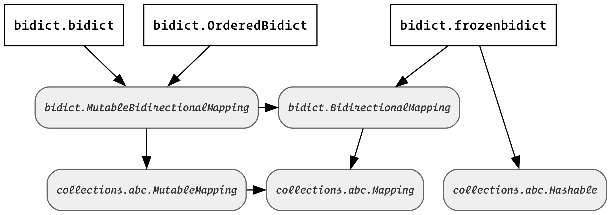

Other ``bidict`` Types
======================

Now that we've covered
:doc:`basic-usage` with the :class:`bidict.bidict` type,
let's look at some other bidirectional mapping types.

.. testsetup::

   from bidict import bidict
   from collections.abc import Mapping, MutableMapping

Bidict Types Diagram
--------------------

All bidirectional mapping types that :mod:`bidict` provides
are subclasses of :class:`bidict.BidirectionalMapping`.
This abstract base class
extends :class:`collections.abc.Mapping`
by adding the
":attr:`~bidict.BidirectionalMapping.inverse`"
:obj:`~abc.abstractproperty`.

As you may have noticed,
:class:`bidict.bidict` is also
a :class:`collections.abc.MutableMapping`.
But :mod:`bidict` provides
immutable bidirectional mapping types as well.

:class:`~bidict.frozenbidict`
-----------------------------

:class:`~bidict.frozenbidict`
is an immutable, hashable bidirectional mapping type.

As you would expect,
attempting to mutate a
:class:`~bidict.frozenbidict`
causes an error:

.. doctest::

   >>> from bidict import frozenbidict
   >>> f = frozenbidict({'H': 'hydrogen'})
   >>> f['C'] = 'carbon'
   Traceback (most recent call last):
       ...
   TypeError: ...

:class:`~bidict.frozenbidict`
also implements :class:`collections.abc.Hashable`,
so it's suitable for insertion into sets or other mappings:

.. doctest::

   >>> my_set = {f}      # not an error
   >>> my_dict = {f: 1}  # also not an error

See the :class:`~bidict.frozenbidict`
API documentation for more information.

:class:`~bidict.OrderedBidict`
------------------------------

:class:`bidict.OrderedBidict`
is a mutable :class:`~bidict.BidirectionalMapping`
that preserves the order in which its items are inserted.
It's like a bidirectional version of :class:`collections.OrderedDict`.

.. doctest::

   >>> from bidict import OrderedBidict
   >>> element_by_symbol = OrderedBidict([
   ...     ('H', 'hydrogen'), ('He', 'helium'), ('Li', 'lithium')])

   >>> element_by_symbol.inverse
   OrderedBidict([('hydrogen', 'H'), ('helium', 'He'), ('lithium', 'Li')])

   >>> first, second, third = element_by_symbol.values()
   >>> first, second, third
   ('hydrogen', 'helium', 'lithium')

   >>> # Insert an additional item and verify it now comes last:
   >>> element_by_symbol['Be'] = 'beryllium'
   >>> last_item = list(element_by_symbol.items())[-1]
   >>> last_item
   ('Be', 'beryllium')

Additional functionality
modeled after :class:`~collections.OrderedDict`
is provided as well:

.. doctest::

   >>> element_by_symbol.popitem(last=True)   # Remove the last item
   ('Be', 'beryllium')
   >>> element_by_symbol.popitem(last=False)  # Remove the first item
   ('H', 'hydrogen')

   >>> # Re-adding hydrogen after it's been removed moves it to the end:
   >>> element_by_symbol['H'] = 'hydrogen'
   >>> element_by_symbol
   OrderedBidict([('He', 'helium'), ('Li', 'lithium'), ('H', 'hydrogen')])

   >>> # But there's also a `move_to_end` method just for this purpose:
   >>> element_by_symbol.move_to_end('Li')
   >>> element_by_symbol
   OrderedBidict([('He', 'helium'), ('H', 'hydrogen'), ('Li', 'lithium')])

   >>> element_by_symbol.move_to_end('H', last=False)  # move to front
   >>> element_by_symbol
   OrderedBidict([('H', 'hydrogen'), ('He', 'helium'), ('Li', 'lithium')])

As with :class:`~collections.OrderedDict`,
updating an existing item preserves its position in the order:

.. doctest::

   >>> element_by_symbol['He'] = 'updated in place!'
   >>> element_by_symbol
   OrderedBidict([('H', 'hydrogen'), ('He', 'updated in place!'), ('Li', 'lithium')])

Collapsing overwrites
#####################

When setting an item in an ordered bidict
whose key duplicates that of an existing item,
and whose value duplicates that of a *different* existing item,
the existing item whose *value* is duplicated will be dropped,
and the existing item whose *key* is duplicated
will have its value overwritten in place:

.. doctest::

   >>> o = OrderedBidict([(1, 2), (3, 4), (5, 6), (7, 8)])
   >>> o.forceput(3, 8)  # item with duplicated value (7, 8) is dropped...
   >>> o  # and the item with duplicated key (3, 4) is updated in place:
   OrderedBidict([(1, 2), (3, 8), (5, 6)])
   >>> # (3, 8) took the place of (3, 4), not (7, 8)

   >>> o = OrderedBidict([(1, 2), (3, 4), (5, 6), (7, 8)])  # as before
   >>> o.forceput(5, 2)  # another example
   >>> o
   OrderedBidict([(3, 4), (5, 2), (7, 8)])
   >>> # (5, 2) took the place of (5, 6), not (1, 2)

.. _eq-order-insensitive:

:meth:`~bidict.OrderedBidict.__eq__` is order-insensitive
#########################################################

To ensure that equality of bidicts is transitive
(and to uphold the
`Liskov substitution principle <https://en.wikipedia.org/wiki/Liskov_substitution_principle>`__),
equality tests between an ordered bidict and other mappings
are always order-insensitive:

.. doctest::

   >>> b = bidict([('one', 1), ('two', 2)])
   >>> o1 = OrderedBidict([('one', 1), ('two', 2)])
   >>> o2 = OrderedBidict([('two', 2), ('one', 1)])
   >>> b == o1
   True
   >>> b == o2
   True
   >>> o1 == o2
   True

For order-sensitive equality tests, use
:meth:`~bidict.FrozenOrderedBidict.equals_order_sensitive`:

.. doctest::

   >>> o1.equals_order_sensitive(o2)
   False
   >>> from collections import OrderedDict
   >>> od = OrderedDict(o2)
   >>> o1.equals_order_sensitive(od)
   False

Note that this differs from the behavior of
:class:`collections.OrderedDict`\'s ``__eq__()``,
by recommendation of Raymond Hettinger (the author) himself.
He later said that making OrderedDict's ``__eq__()``
intransitive was a mistake.

What if my Python version has order-preserving dicts?
#####################################################

In PyPy as well as CPython ≥ 3.6,
:class:`dict` preserves insertion order.
If you are using one of these versions of Python,
you may wonder whether you can get away with
using a regular :class:`bidict.bidict`
in places where you need
an insertion order-preserving bidirectional mapping.

In general the answer is no,
particularly if you need to be able to change existing associations
in the bidirectional mapping while preserving order correctly.

Consider this example using a regular :class:`~bidict.bidict`
with an order-preserving :class:`dict` version of Python:

.. doctest::
   :pyversion: >= 3.6

    >>> b = bidict([(1, -1), (2, -2), (3, -3)])
    >>> b[2] = 'UPDATED'
    >>> b
    bidict({1: -1, 2: 'UPDATED', 3: -3})
    >>> b.inverse  # oops:
    bidict({-1: 1, -3: 3, 'UPDATED': 2})

When the value associated with the key ``2`` was changed,
the corresponding item stays in place in the forward mapping,
but moves to the end of the inverse mapping.
Since regular :class:`~bidict.bidict`\s
provide no guarantees about order preservation
(which allows for a more efficient implementation),
non-order-preserving behavior
(as in the example above)
is exactly what you get.

If you never mutate a bidict
(or are even using a :class:`~bidict.frozenbidict`)
and you're running a version of Python
with order-preserving :class:`dict`\s,
then you'll find that the order of the items
in your bidict and its inverse happens to be preserved.
However, you won't get the additional order-specific APIs
(such as
:meth:`~bidict.OrderedBidict.move_to_end`,
:meth:`~bidict.OrderedBidict.equals_order_sensitive`, and
:meth:`~bidict.OrderedBidict.__reversed__` –
indeed the lack of a ``dict.__reversed__`` API
is what stops us from making
:class:`~bidict.FrozenOrderedBidict` an alias of
:class:`~bidict.frozenbidict` on dict-order-preserving Pythons,
as this would mean
:meth:`FrozenOrderedBidict.__reversed__() <bidict.FrozenOrderedBidict.__reversed__>`
would have to be O(n) in space complexity).

If you need order-preserving behavior guaranteed,
then :class:`~bidict.OrderedBidict` is your best choice.

:class:`~bidict.FrozenOrderedBidict`
------------------------------------

:class:`~bidict.FrozenOrderedBidict`
is an immutable ordered bidict type.
It's like an :class:`~bidict.OrderedBidict`
without the mutating APIs,
or equivalently like an order-preserving
:class:`~bidict.frozenbidict`.

:func:`~bidict.namedbidict`
---------------------------

:func:`bidict.namedbidict`,
inspired by :func:`collections.namedtuple`,
allows you to easily generate
a new bidirectional mapping type
with custom attribute-based access to forward and inverse mappings:

.. doctest::

   >>> from bidict import namedbidict
   >>> ElementMap = namedbidict('ElementMap', 'symbol', 'name')
   >>> noble_gases = ElementMap(He='helium')
   >>> noble_gases.name_for['He']
   'helium'
   >>> noble_gases.symbol_for['helium']
   'He'
   >>> noble_gases.name_for['Ne'] = 'neon'
   >>> del noble_gases.symbol_for['helium']
   >>> noble_gases
   ElementMap({'Ne': 'neon'})

Using the *base_type* keyword arg –
whose default value is :class:`bidict.bidict` –
you can override the bidict type used as the base class,
allowing the creation of e.g. a named frozenbidict type:

.. doctest::

   >>> ElMap = namedbidict('ElMap', 'symbol', 'name', base_type=frozenbidict)
   >>> noble = ElMap(He='helium')
   >>> noble.symbol_for['helium']
   'He'
   >>> hash(noble) is not TypeError  # does not raise TypeError: unhashable type
   True
   >>> noble['C'] = 'carbon'  # mutation fails
   Traceback (most recent call last):
   ...
   TypeError: ...

Polymorphism
------------

(Or: ABCs ftw!)

You may be tempted to write something like ``isinstance(obj, dict)``
to check whether ``obj`` is a :class:`~collections.abc.Mapping`.
However, this check is too specific, and will fail for many
types that implement the :class:`~collections.abc.Mapping` interface:

.. doctest::
   :pyversion: >= 3.3

   >>> from collections import ChainMap
   >>> issubclass(ChainMap, dict)
   False

The same is true for all the bidict types:

.. doctest::

   >>> issubclass(bidict, dict)
   False

The proper way to check whether an object
is a :class:`~collections.abc.Mapping`
is to use the abstract base classes (ABCs)
from the :mod:`collections` module
that are provided for this purpose:

.. doctest::
   :pyversion: >= 3.3

   >>> issubclass(ChainMap, Mapping)
   True
   >>> isinstance(bidict(), Mapping)
   True

Also note that the proper way to check whether an object
is an (im)mutable mapping is to use the
:class:`~collections.abc.MutableMapping` ABC:

.. doctest::

   >>> from bidict import BidirectionalMapping

   >>> def is_immutable_bimap(obj):
   ...     return (isinstance(obj, BidirectionalMapping)
   ...             and not isinstance(obj, MutableMapping))

   >>> is_immutable_bimap(bidict())
   False

   >>> is_immutable_bimap(frozenbidict())
   True

Checking for ``isinstance(obj, frozenbidict)`` is too specific
and could fail in some cases.
For example, :class:`~bidict.FrozenOrderedBidict` is an immutable mapping
but it does not subclass :class:`~bidict.frozenbidict`:

.. doctest::

   >>> from bidict import FrozenOrderedBidict
   >>> obj = FrozenOrderedBidict()
   >>> is_immutable_bimap(obj)
   True
   >>> isinstance(obj, frozenbidict)
   False

Besides the above, there are several other collections ABCs
whose interfaces are implemented by various bidict types.
Have a look through the :mod:`collections.abc` documentation
if you're interested.

One thing you might notice is that there is no
``Ordered`` or ``OrderedMapping`` ABC.
However, Python 3.6 introduced the :class:`collections.abc.Reversible` ABC.
Since being reversible implies having an ordering,
you could check for reversibility instead.
For example:

.. doctest::
   :pyversion: >= 3.6

   >>> from collections.abc import Reversible

   >>> def is_reversible_mapping(cls):
   ...     return issubclass(cls, Reversible) and issubclass(cls, Mapping)
   ...

   >>> is_reversible_mapping(OrderedBidict)
   True

   >>> is_reversible_mapping(OrderedDict)
   True

For more you can do with :mod:`bidict`,
check out :doc:`extending` next.
