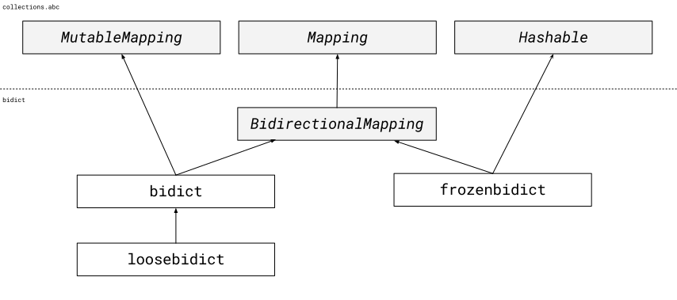

.. _other-bidict-types:

Other ``bidict`` Types
======================

Now that we've covered the basics of
:ref:`bidict.bidict <basic-usage>`,
:ref:`bidict.loosebidict <loosebidict>`,
and other preliminaries,
let's look at the remaining bidict types
and the hierarchy they belong to.

``bidict`` Class Hierarchy
--------------------------

At the top of the bidict type hierarchy is
:class:`bidict.BidirectionalMapping`.
This implements the :class:`collections.abc.Mapping` ABC
and contains the shared logic allowing keys to be looked up by value
(as well as values to be looked up by key).
Most users will only ever need to use one of its subclasses.

At this point the type hierarchy tree forks into
a mutable branch and an immutable branch.
On the mutable side we have
:class:`bidict.bidict`
(which implements :class:`collections.abc.MutableMapping`)
and finally
:class:`bidict.loosebidict`,
the leaf on this side of the tree.

.. include:: frozenbidict.rst.inc

.. include:: orderedbidict.rst.inc

.. include:: namedbidict.rst.inc

.. include:: polymorphism.rst.inc
