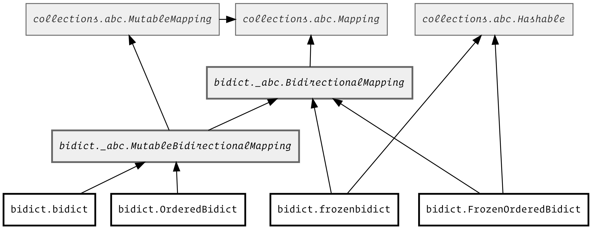

Other ``bidict`` Types
======================

Now that we've covered
:doc:`basic-usage` with the :class:`bidict.bidict` type,
let's look at some other bidirectional mapping types.

Bidict Types Diagram
--------------------

All bidirectional mapping types that :mod:`bidict` provides
are subclasses of :class:`bidict.BidirectionalMapping`.
This abstract base class
extends :class:`collections.abc.Mapping`
by adding the
":attr:`~bidict.BidirectionalMapping.inverse`"
:obj:`~abc.abstractproperty`.

As you may have noticed,
:class:`bidict.bidict` is also
a :class:`collections.abc.MutableMapping`.
But :mod:`bidict` provides
immutable bidirectional mapping types as well.

:class:`~bidict.frozenbidict`
-----------------------------

:class:`~bidict.frozenbidict`
is an immutable, hashable bidirectional mapping type.

As you would expect,
attempting to mutate a
:class:`~bidict.frozenbidict`
causes an error:

.. doctest::

   >>> from bidict import frozenbidict
   >>> f = frozenbidict({'H': 'hydrogen'})
   >>> f['C'] = 'carbon'
   Traceback (most recent call last):
       ...
   TypeError: 'frozenbidict' object does not support item assignment

:class:`~bidict.frozenbidict`
also implements :class:`collections.abc.Hashable`,
so it's suitable for insertion into sets or other mappings:

.. doctest::

   >>> my_set = {f}      # not an error
   >>> my_dict = {f: 1}  # also not an error

:class:`~bidict.OrderedBidict`
------------------------------

:class:`bidict.OrderedBidict`
is a :class:`~bidict.MutableBidirectionalMapping`
that preserves the ordering of its items,
and offers some additional ordering-related APIs
that unordered bidicts can't offer.
It's like a bidirectional version of :class:`collections.OrderedDict`.

.. doctest::

   >>> from bidict import OrderedBidict
   >>> element_by_symbol = OrderedBidict({
   ...     'H': 'hydrogen', 'He': 'helium', 'Li': 'lithium'})

   >>> element_by_symbol.inverse
   OrderedBidict([('hydrogen', 'H'), ('helium', 'He'), ('lithium', 'Li')])

   >>> first, second, third = element_by_symbol.values()
   >>> first, second, third
   ('hydrogen', 'helium', 'lithium')

   >>> # Insert an additional item and verify it now comes last:
   >>> element_by_symbol['Be'] = 'beryllium'
   >>> last_item = list(element_by_symbol.items())[-1]
   >>> last_item
   ('Be', 'beryllium')

Additional, efficiently-implemented, order-mutating APIs
modeled after :class:`~collections.OrderedDict`, e.g.
:meth:`popitem(last: bool) <bidict.OrderedBidict.popitem>`,
which makes ordered bidicts suitable for use as FIFO queues, and
:meth:`move_to_end(last: bool) <bidict.OrderedBidict.move_to_end>`,
are provided as well:

.. doctest::

   >>> element_by_symbol.popitem(last=True)   # Remove the last item
   ('Be', 'beryllium')
   >>> element_by_symbol.popitem(last=False)  # Remove the first item
   ('H', 'hydrogen')

   >>> # Re-adding hydrogen after it's been removed moves it to the end:
   >>> element_by_symbol['H'] = 'hydrogen'
   >>> element_by_symbol
   OrderedBidict([('He', 'helium'), ('Li', 'lithium'), ('H', 'hydrogen')])

   >>> # But there's also a `move_to_end` method just for this purpose:
   >>> element_by_symbol.move_to_end('Li')
   >>> element_by_symbol
   OrderedBidict([('He', 'helium'), ('H', 'hydrogen'), ('Li', 'lithium')])

   >>> element_by_symbol.move_to_end('H', last=False)  # move to front
   >>> element_by_symbol
   OrderedBidict([('H', 'hydrogen'), ('He', 'helium'), ('Li', 'lithium')])

As with :class:`~collections.OrderedDict`,
updating an existing item preserves its position in the order:

.. doctest::

   >>> element_by_symbol['He'] = 'updated in place!'
   >>> element_by_symbol
   OrderedBidict([('H', 'hydrogen'), ('He', 'updated in place!'), ('Li', 'lithium')])

Collapsing overwrites
#####################

When setting an item in an ordered bidict
whose key duplicates that of an existing item,
and whose value duplicates that of a *different* existing item,
the existing item whose *value* is duplicated will be dropped,
and the existing item whose *key* is duplicated
will have its value overwritten in place:

.. doctest::

   >>> o = OrderedBidict([(1, 2), (3, 4), (5, 6), (7, 8)])
   >>> o.forceput(3, 8)  # item with duplicated value (7, 8) is dropped...
   >>> o  # and the item with duplicated key (3, 4) is updated in place:
   OrderedBidict([(1, 2), (3, 8), (5, 6)])
   >>> # (3, 8) took the place of (3, 4), not (7, 8)

   >>> o = OrderedBidict([(1, 2), (3, 4), (5, 6), (7, 8)])  # as before
   >>> o.forceput(5, 2)  # another example
   >>> o
   OrderedBidict([(3, 4), (5, 2), (7, 8)])
   >>> # (5, 2) took the place of (5, 6), not (1, 2)

.. _eq-order-insensitive:

:meth:`~bidict.OrderedBidict.__eq__` is order-insensitive
#########################################################

To ensure that equals comparison for any bidict always upholds the
`transitive property of equality
<https://en.wikipedia.org/wiki/Equality_(mathematics)#Basic_properties>`__ and the
`Liskov substitution principle <https://en.wikipedia.org/wiki/Liskov_substitution_principle>`__,
equality tests between a bidict and another mapping
are always order-insensitive,
even for ordered bidicts:

.. doctest::

   >>> o1 = OrderedBidict({1: 1, 2: 2})
   >>> o2 = OrderedBidict({2: 2, 1: 1})
   >>> o1 == o2
   True

For order-sensitive equality tests, use
:meth:`~bidict.BidictBase.equals_order_sensitive`:

.. doctest::

   >>> o1.equals_order_sensitive(o2)
   False

(Note that this differs from the behavior of
:meth:`collections.OrderedDict.__eq__`,
and for good reason,
by recommendation of the Python core developer
who designed and implemented :class:`~collections.OrderedDict`.
For more about this, see
:ref:`learning-from-bidict:Python surprises`.)

What about order-preserving dicts?
##################################

In CPython 3.6+ and all versions of PyPy,
:class:`dict` (which bidicts are built on by default)
preserves insertion order.
Given that, can you get away with
using an unordered bidict
in places where you need
an order-preserving bidirectional mapping?
Of course, this assumes you don't need the additional APIs
offered only by :class:`~bidict.OrderedBidict`, such as
:meth:`popitem(last=False) <bidict.OrderedBidict.popitem>`,
which makes it suitable for use as a FIFO queue.

Consider this example:

.. doctest::

    >>> b = bidict({1: -1, 2: -2, 3: -3})
    >>> b[2] = 'UPDATED'
    >>> b
    bidict({1: -1, 2: 'UPDATED', 3: -3})

So far so good, but look what happens here:

.. doctest::

    >>> b.inverse
    bidict({-1: 1, -3: 3, 'UPDATED': 2})

The ordering of items between the bidict
and its inverse instance is no longer consistent.

To ensure that ordering is kept consistent
between a bidict and its inverse,
no matter how it's mutated,
you have to use an ordered bidict:

    >>> ob = OrderedBidict({1: -1, 2: -2, 3: -3})
    >>> ob[2] = 'UPDATED'
    >>> ob
    OrderedBidict([(1, -1), (2, 'UPDATED'), (3, -3)])
    >>> ob.inverse
    OrderedBidict([(-1, 1), ('UPDATED', 2), (-3, 3)])

The ordered bidict and its inverse always give you a consistent ordering.

That said, if you depend on preserving insertion order,
an unordered bidict may be sufficient if:

* you'll never mutate it
  (in which case, use a :class:`~bidict.frozenbidict`),
  or:

* you only mutate by removing and/or adding whole new items,
  never changing just the key or value of an existing item,
  or:

* you only depend on the order in the forward bidict,
  and are only changing existing items in the forward direction
  (i.e. changing values by key, rather than changing keys by value).

On the other hand, if your code is actually depending on the order,
using an explicitly-ordered bidict type makes for clearer code.

:class:`~bidict.OrderedBidict` also gives you
additional, constant-time, order-mutating APIs, such as
:meth:`move_to_end(last: bool) <bidict.OrderedBidict.move_to_end>` and
:meth:`popitem(last: bool) <bidict.OrderedBidict.popitem>`.
These additional APIs expand the range of use cases
where an :class:`~bidict.OrderedBidict` can be used.
For example, ``popitem(last=False)`` allows using an
:class:`~bidict.OrderedBidict` as a FIFO queue.

Reversing a bidict
------------------

All bidict (and their associated views) are reversible
(since dicts are reversible on all supported Python versions,
e.g. CPython 3.8+).

.. doctest::

    >>> b = bidict({1: 'one', 2: 'two', 3: 'three'})
    >>> list(reversed(b))
    [3, 2, 1]
    >>> list(reversed(b.items()))
    [(3, 'three'), (2, 'two'), (1, 'one')]

Polymorphism
------------

Code that needs to check only whether an object is *dict-like*
should not use ``isinstance(obj, dict)``.
This check is too specific, because dict-like objects need not
actually be instances of dict or a dict subclass.
You can see this fails for many dict-like objects in the standard library:

.. doctest::

   >>> from collections import ChainMap
   >>> chainmap = ChainMap()
   >>> isinstance(chainmap, dict)
   False

The same is true for all the bidict types:

.. doctest::

   >>> bi = bidict()
   >>> isinstance(bi, dict)
   False

A better way to check whether an object is dict-like
is to use the :class:`~collections.abc.Mapping`
abstract base class (ABC)
from the :mod:`collections.abc` module,
which provides a number of ABCs
intended for this purpose:

.. doctest::

   >>> isinstance(chainmap, Mapping)
   True
   >>> isinstance(bi, Mapping)
   True

Also note that the proper way to check whether an object
is an (im)mutable mapping is to use the
:class:`~collections.abc.MutableMapping` ABC:

.. doctest::

   >>> isinstance(chainmap, MutableMapping)
   True
   >>> isinstance(bi, MutableMapping)
   True

To illustrate this,
here's an example of how you can combine the above
with bidict's own :class:`~bidict.BidirectionalMapping` ABC
to implement your own check for whether
an object is an immutable, bidirectional mapping:

.. doctest::

   >>> def is_immutable_bimap(obj):
   ...     return (isinstance(obj, BidirectionalMapping)
   ...             and not isinstance(obj, MutableMapping))

   >>> is_immutable_bimap(bidict())
   False

   >>> is_immutable_bimap(frozenbidict())
   True

For more you can do with :mod:`bidict`,
check out :doc:`extending` next.
